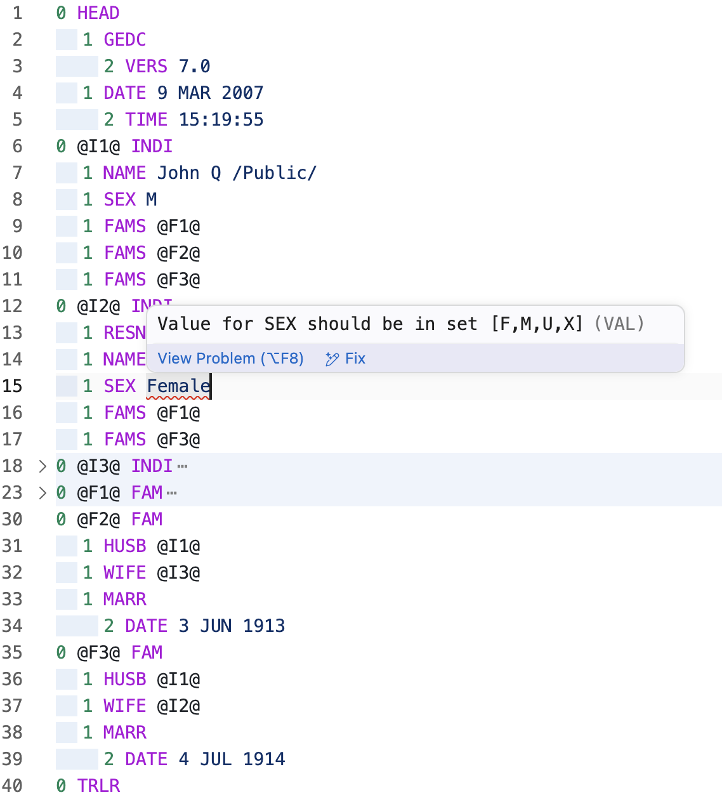

# Domorium

Apps for working with `.ged` (GEDCOM) files.
Provides syntax highlighting and validation for genealogical data.

---

## ✨ Features

- GEDCOM syntax highlighting
- Structural validation of GEDCOM files



---

## Planned Features

### Simple Features

- [ ] **File Structure Tree** — View the GEDCOM file as a hierarchical tree.
- [ ] **Hover Preview for Links** — Shows an image or preview when hovering over a link.
- [ ] **Clickable Local File Links** — Open local files directly by clicking the link.
- [ ] **Import/Export Gzip Archive** — Compress or extract GEDCOM files.
- [ ] **Tag Autocomplete / Hinting** — Suggest valid tags while typing.
- [ ] **Validation of Dates and Web Links** — Checks that dates and URLs are correctly formatted.
- [ ] **Validation of XREFs and Pointers** — Ensures cross-references are valid.
- [ ] **Customizable Configuration** — Users can tweak extension settings to their needs.
- [ ] **Command Palette Integration** — Add commands accessible via VS Code command palette.
- [ ] **Localization of Descriptions and Errors** — Multi-language support for messages and errors.

### Advanced Features

- [ ] **Family Tree Visualization (Webview)** — Interactive visual representation of the family tree with filtering, color coding, and navigation using Excalidraw.
- [ ] **Forms Page View** — Editable forms for individuals and families, including cross-references between records.
- [ ] **Map View** — Display locations of events such as birth, marriage, and death on a map.
- [ ] **Timeline View** — Visual timeline showing all events chronologically.
- [ ] **Advanced Text Editor (Markdown)** — Rich text editing with Markdown support for notes and documentation.
- [ ] **Export Dates to Standard iCalendar (.ics)** — Generate calendar files from event dates for import into Google Calendar, Outlook, or other calendars.
---

## 🤝 Contributing

Want to contribute? Great!

1. Clone the repository
2. Install dependencies:

   ```bash
   npm install
   ```

3. Start debugging:

   ```bash
   npm run watch
   npm run open
   ```

---

## 📜 License

MIT © 2025
