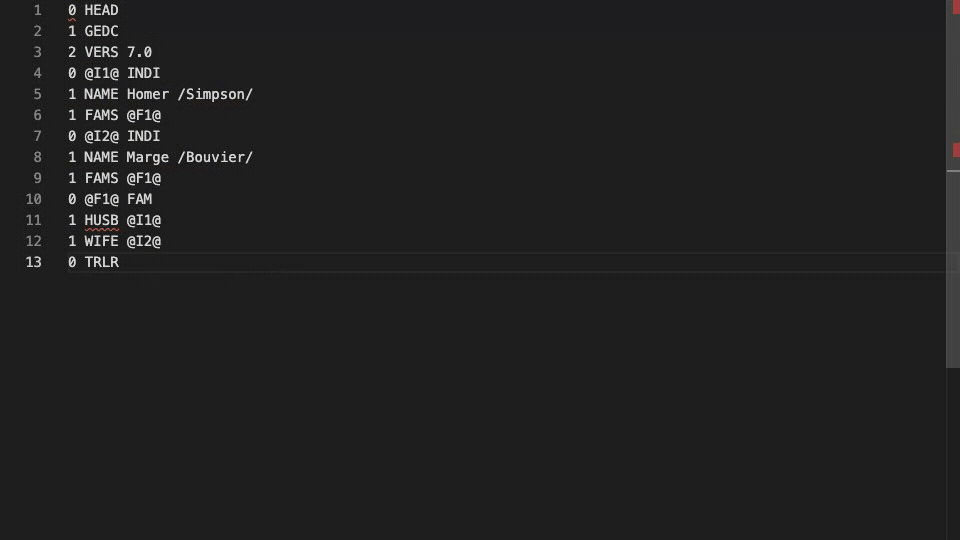

# GEDCOM for Visual Studio Code

GEDCOM helps you read and edit `.ged` and `.gedcom` files with confidence. It understands the GEDCOM structure, suggests valid entries, and reports problems as you type.



## Features

- Context-aware GEDCOM autocomplete
- Real-time structural validation
- Semantic syntax highlighting
- Hover information for GEDCOM tags
- Go to definition for cross-references
- Find all XREF references with read/write highlights
- Safe, atomic XREF rename
- Clickable web and local-file links
- Quick fixes for broken references and invalid levels
- Code folding for records and nested structures
- Support for `.ged` and `.gedcom` files

## Installation

Install [GEDCOM from the Visual Studio Marketplace](https://marketplace.visualstudio.com/items?itemName=lavich.gedcom-vscode), or run:

```bash
code --install-extension lavich.gedcom-vscode
```

You can also [try GEDCOM in your browser](https://lavich.github.io/gedcom/).

## Contributing

See the [project repository](https://github.com/lavich/gedcom) for development setup and contribution instructions.

## License

MIT © 2025 Andrei Lobanov
