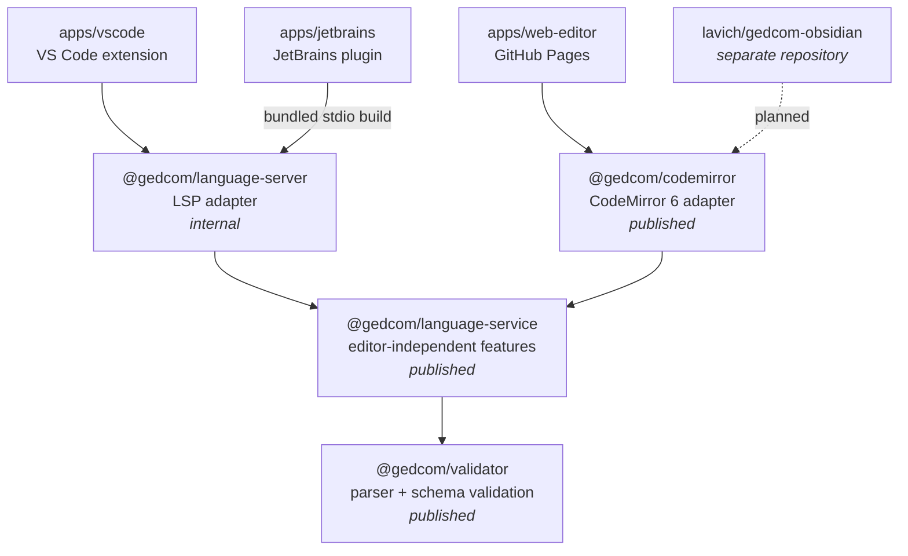

# Architecture

This repository is an npm workspace monorepo. GEDCOM language intelligence is
implemented once and adapted to each editor host, rather than reimplemented per
platform.

Dependencies point in one direction only: from editor hosts, through an adapter,
into editor-independent language logic, into the parser. Nothing lower in the
stack knows anything about the layers above it.

An arrow means "depends on". Every arrow points down the stack; none points back
up.

## Layers

### `packages/validator` — `@gedcom/validator`

Published to npm. Owns everything about the GEDCOM format itself and nothing
about editors.

A Chevrotain-based lexer and parser turn `.ged` text into an AST, which is
validated against schemas derived from the official GEDCOM 5.5.1 and 7.0
specifications: structure, cardinality, and payload types. `GedcomDocument` is
the entry point; `getErrors()` returns structural diagnostics.

Both schemas are consumed by `src/validator/validate.ts`, but they are maintained
differently. `src/schemes/g7validation.json` is generated from the upstream
GEDCOM 7 specification by `npm run generate -w packages/validator` and must not
be hand-edited. `src/schemes/g551validation.json` has no generator — GEDCOM 5.5.1
is only published as prose, so that schema is maintained by hand and a 5.5.1 fix
means editing it directly.

Runtime dependencies are `chevrotain` and `ts-brand`. Requires Node.js 22 or
newer when used directly in Node.js.

### `packages/language-service` — `@gedcom/language-service`

Published to npm. Turns a validated document into editor features, while staying
independent of any editor and of the Language Server Protocol runtime.

`GedcomLanguageService` provides diagnostics, completion, hover, definitions,
references, rename, folding ranges, document symbols, semantic tokens, document
links, indentation hints, and code actions — one directory per concern under
`src/libs/`.

The important constraint is `src/types.ts`. This package declares its own
protocol-shaped types (`Position`, `Range`, `Diagnostic`, `WorkspaceEdit`, and
the rest) instead of importing them from `vscode-languageserver-protocol`. That
is what makes the package usable from a browser editor or a note-taking plugin
that has no LSP runtime. Adding an LSP dependency here would collapse the
distinction between this layer and the one above it.

Positions are line/character pairs. Conversion to and from byte offsets is the
adapter's job, not this package's.

### `packages/language-server` — `@gedcom/language-server`

Internal, not published. Adapts the language service to the Language Server
Protocol.

`createServer` builds a server over an arbitrary connection, and `src/stdio.ts`
is a standalone entry point bundled by esbuild into `dist-stdio/stdio.cjs.js` for
hosts that spawn a process. Among the shared packages, LSP dependencies are confined
to this one; an editor host may of course depend on its own platform's LSP client and
runtime, as `apps/vscode` does.

`src/index.ts` re-exports all of `@gedcom/language-service`, so a consumer of
this package does not need to depend on both.

### `packages/codemirror` — `@gedcom/codemirror`

Published to npm. Adapts the language service to CodeMirror 6.

`createGedcomExtensions` and `createStandaloneEditorExtensions` produce the
extension set; `positions.ts` converts between the language service's
line/character positions and CodeMirror offsets; `service.ts` translates
workspace edits into CodeMirror changes; `commands.ts` implements navigation and
rename commands.

All `@codemirror/*` and `@lezer/*` dependencies are peer dependencies. CodeMirror
requires a single instance of each of its packages at runtime; bundling them into
this package would break any host that already has its own copy.

## Editor hosts

| App               | Consumes                  | Notes                                                                                                     |
| ----------------- | ------------------------- | --------------------------------------------------------------------------------------------------------- |
| `apps/vscode`     | `@gedcom/language-server` | Web extension: `browser` entry only, with a client and an in-worker server bundle                         |
| `apps/jetbrains`  | `@gedcom/language-server` | Gradle build runs `build:stdio` and bundles the result onto the plugin classpath as `server/stdio.cjs.js` |
| `apps/web-editor` | `@gedcom/codemirror`      | Vite app deployed to GitHub Pages from `main` when web-related paths change                               |

The Obsidian plugin lives in a separate repository,
[lavich/gedcom-obsidian](https://github.com/lavich/gedcom-obsidian), and will
consume the published `@gedcom/codemirror` package. This repository stays the
source of truth for editor-independent behavior; the Obsidian repository owns only
Obsidian integration — its view lifecycle, vault persistence, settings, commands,
and link handling.

## Build order

Package builds chain their own prerequisites rather than relying on a task
runner: `language-service` builds `validator` first, and `language-server` builds
`language-service` first. The root `postinstall` runs `build:libs`, so a fresh
`npm install` produces usable `dist` output.

Consequence worth knowing: after changing a lower layer, a consumer that imports
from `dist` sees stale output until that layer is rebuilt. `npm run build:libs`
from the root is the blunt fix; `npm run watch -w packages/<name>` is the
iterative one.

## Release topology

Each releasable unit is versioned and tagged independently. Pushing a tag
triggers the matching workflow in `.github/workflows/`.

| Unit                       | Tag pattern               | Target                          |
| -------------------------- | ------------------------- | ------------------------------- |
| `@gedcom/validator`        | `validator-v*.*.*`        | npm                             |
| `@gedcom/language-service` | `language-service-v*.*.*` | npm                             |
| `@gedcom/codemirror`       | `codemirror-v*.*.*`       | npm                             |
| VS Code extension          | `vscode-v*.*.*`           | VS Code Marketplace             |
| JetBrains plugin           | `jetbrains-v*.*.*`        | JetBrains Marketplace           |
| Web editor                 | none                      | GitHub Pages on merge to `main` |

## Invariants

These are the properties that make the layering worth having. Breaking one
usually means a feature has been implemented at the wrong level.

- No package below the adapter layer imports an editor API or an LSP type.
- `@gedcom/language-service` never depends on `vscode-languageserver-protocol`.
- Genealogy logic belongs in a shared package, not in an app. Two apps needing
  the same behavior is a signal to move it down, not to copy it.
- CodeMirror packages stay external and single-instanced.
- Semantic edits preserve reciprocal GEDCOM pointers and revalidate the result.
- Generated files (`g7validation.json`, all `dist` output) are never edited by
  hand. `g551validation.json` is not generated and is the exception.

## Related documents

- [docs/adr/](adr/) — why the architecture is shaped this way
- [TODO.md](../TODO.md) — near-term work
- [docs/roadmap.md](roadmap.md) — longer-range directions, including possible shared
  packages (`query`, `graph`, `mutations`) that would sit alongside
  `language-service`
